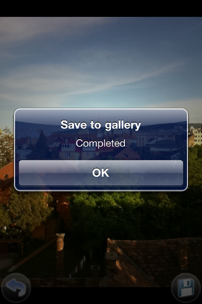

<!-- <mosyncheadertags>
<meta name="description" content="This guide shows how to use the MoSync Camera API." /> <meta name="keywords" content="mobile development,sdk,ide,apps,mobile,apps,android,ios,iphone,ipad,camera,
mobile,c,c++,open source,porting,dev,application,ide,cross
platform,programming,mosync,camera,example" />
<title>MoCamera</title>
</mosyncheadertags> -->

# MoCamera

MoCamera is a C++ application built with the MoSync SDK, that makes use of the [NativeUI::Camera](http://www.mosync.com/files/imports/doxygen/latest/html/class_native_u_i_1_1_camera.html) widget in order to control camera functionality and camera preview layout.

Everything that this application uses is explained in [the NativeUI Camera guide](TEMPLATE_DOC_PATH/sdk/cpp/guides/camera/native-camera-api/index.html).

***

### Android

 

### iOS

 

### Windows Phone

 

This example is included in the MoSync SDK installation in the /examples/cpp folder. For information on importing the examples into your workspace, see [Importing the Examples](TEMPLATE_DOC_PATH/sdk/tools/guides/ide/importing-example-applications/index.html).

## Behaviour

The application uses [NativeUI C++ Library](TEMPLATE_DOC_PATH/sdk/cpp/guides/nativeui/using-nativeui-library/index.html) and consists of two screens:

* **CameraScreen** This is the default screen. This screen displays (using [relative layout](http://www.mosync.com/files/imports/doxygen/latest/html/class_native_u_i_1_1_relative_layout.html)) the camera preview and some of the main camera functionalities via [ImageButton](http://www.mosync.com/files/imports/doxygen/latest/html/class_native_u_i_1_1_image_button.html).\\
This screen allows you too change flash modes, zoom level (Only on Android for the moment), swap between front and back camera (if the device and api allows), take a snapshot and view it.\\
Focus is done automaticaly or when tapping the screen (on Android devices).

* **ImageViewerScreen** This screen displays the snapshot taken in the CameraScreen. Using the "Save image" button from this screen you can export the taken picture to the phone gallery.

***

## The Code

The project is divided into several files. Each screen is implemented in a separate set of header and cpp files.

 

You can find the [Camera](http://www.mosync.com/files/imports/doxygen/latest/html/class_native_u_i_1_1_camera.html) related functionality in CameraScreen.h/cpp. For the [CameraListeners](TEMPLATE_DOC_PATH/sdk/cpp/guides/camera/native-camera-api/index.html) see the MoCameraController.h/cpp. This class contains the business logic of the application.

In the `MoCameraController` class you can also find the `maSaveImageToDeviceGallery` function used for exporting an image to the photo library of the device. For more details see the [maSaveImageToDeviceGallery](http://www.mosync.com/files/imports/doxygen/latest/html/maapi_8h.html#a4f89bd85583067d7a3549d0a2fb33cd3) function.

***