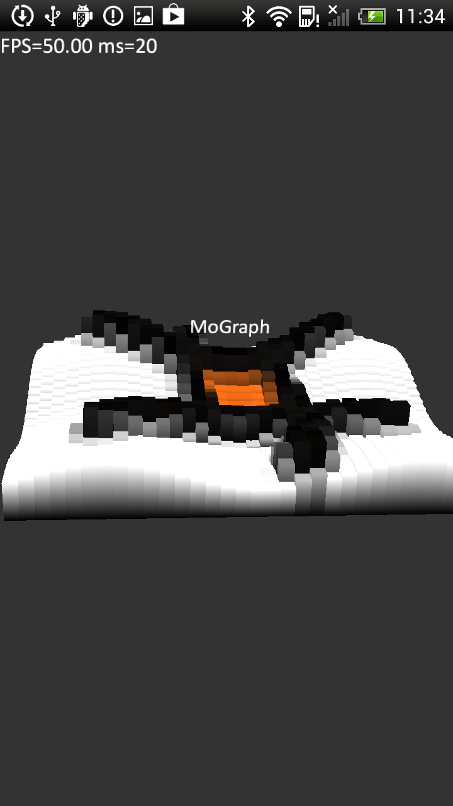

<!-- <mosyncheadertags>
<meta name="description" content="MoGraph Example Apps" />
<meta name="keywords" content="mobile development,sdk,ide,apps,mobile,apps,android,ios,iphone,ipad,opengl,
graph,diagram,mobile,c,c++,open source,porting,dev,application,ide,cross
platform,programming,mosync,native ui,nativeui" />
<title>MoGraph Example Apps</title>
</mosyncheadertags> -->

# MoGraph Example Apps

Supported platforms: Android and iOS.

## Overview

MoGraph is a C++ library for creating 3D graphs and diagrams.

MoSync SDK comes with three example applications that show how to use this library. These applications are described below. All these example apps come bundled with the MoSync SDK download. The examples are found in the MoSync SDK installation in the /examples/cpp folder. For how to import the examples into your workspace, see [Importing the Examples](TEMPLATE_DOC_PATH/sdk/tools/guides/ide/importing-example-applications/index.html).

To learn the basics about MoGraph, go to the [MoGraph Library guide](http://www.mosync.com/docs/sdk/cpp/guides/graphics/mograph/index.html) for a short tutorial.

## MoGraphWave

The first example shows how to use the MoGraph library to draw an animated diagram generated from a sine wave.

Screenshots from the app:

{: .screenshot}
{: .screenshot}

Rotate the diagram by dragging your finger across the screen. Zoom by using two fingers.

The [source code for MoGraphWave](https://github.com/MoSync/MoSync/blob/ThreeThree/examples/cpp/MoGraph/MoGraphWave/main.cpp) can be browsed online at GitHub.

## MoGraphWave2

The second example is a variation of the first example. It draws the MoSync logo, rendered in 3D using the bars of the diagram to produce a height map. This example shows the potential for using MoGraph for artistic purposes and games.

Screenshots from the app:

{: .screenshot}
{: .screenshot}

Rotate the diagram by dragging your finger across the screen. Zoom by using two fingers.

The [source code for MoGraphWave2](https://github.com/MoSync/MoSync/blob/ThreeThree/examples/cpp/MoGraph/MoGraphWave2/main.cpp) can be browsed online at GitHub.

## MoGraphFinance

The third example shows how to render a diagram in realtime from downloaded data.

Screenshots from the app:

{: .screenshot}
{: .screenshot}

As with the other apps, rotate the diagram by dragging your finger across the screen, and zoom by using two fingers.

The [source code for MoGraphFinance](https://github.com/MoSync/MoSync/blob/ThreeThree/examples/cpp/MoGraph/MoGraphFinance/main.cpp) can be browsed online at GitHub.
