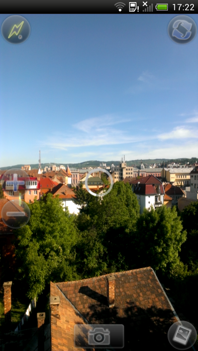
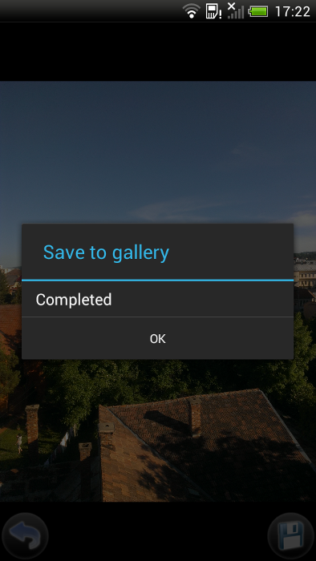
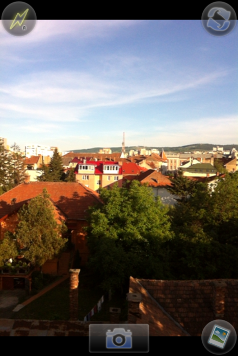
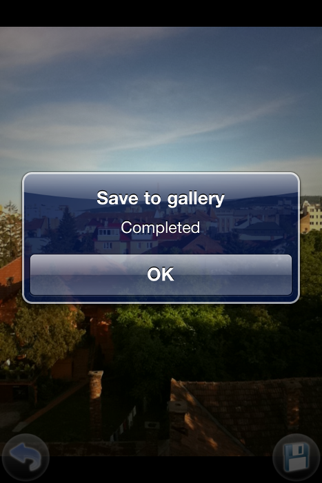
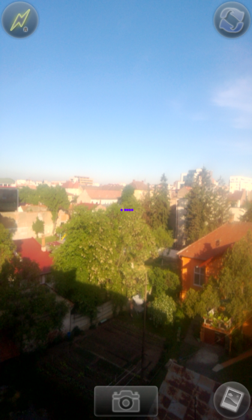
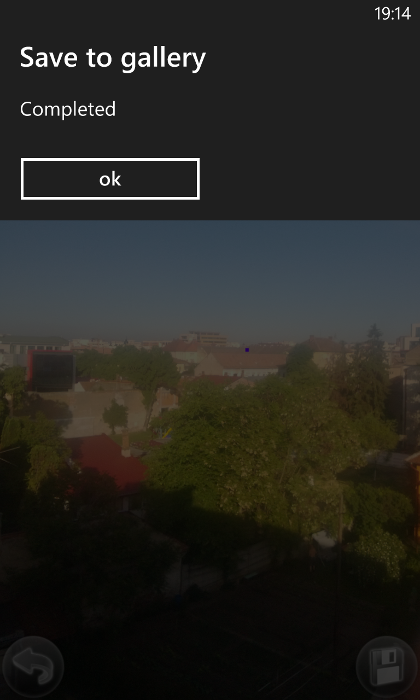

<!-- <mosyncheadertags>
<meta name="description" content="This guide shows how to use the MoSync Camera API." /> <meta name="keywords" content="mobile development,sdk,ide,apps,mobile,apps,android,ios,iphone,ipad,camera,
mobile,c,c++,open source,porting,dev,application,ide,cross
platform,programming,mosync,camera" />
<title>The NativeUI Camera API</title>
</mosyncheadertags> -->

# The NativeUI Camera API

In this tutorial we will learn how to create a Camera widget using Native UI. With this widget you can control the display of the camera preview and control the camera functionalities like snapshot, preview frames, zoom, flash, focus and switching between the cameras of the device.

As a reminder the [NativeUI C++ Library](http://www.mosync.com/documentation/manualpages/using-nativeui-library) and the underlying Widget C API are designed to work with native user-interface controls. The library is designed to support platforms with native (i.e. proprietary) touch and graphical interfaces such as Android, iOS, and Windows Phone.Some widgets are specific to one particular platform. Also for other platform support information please see [Feature/Platform Support](http://www.mosync.com/widepage/feature-platform-support).

Note that if you want to deploy on Android devices you will need to add Camera permissions. To do this you need to select the project Properties > MoSync Project > Application Permission and check the Camera check-box. Find more info about this by taking [a tour of the MoSync IDE](http://www.mosync.com/documentation/manualpages/getting-started-mosync-ide).

***

## **Camera widget creation**

There is a corresponding NativeUI class for camera functionality. The class is `Camera` (TODO Add Link to documentation - not available yet).
If you want to use it you will need to include the Camera.h header.
The first step is to instantiate the camera and this is very easy:

		NativeUI::Camera* myCameraWidget = new NativeUI::Camera();

Please see the [NativeUI C++ Library](http://www.mosync.com/documentation/manualpages/using-nativeui-library) for the UI related properties/methods of this widget. This guide will mainly specify only camera related instructions.

***

## **Camera methods**

Here are a few camera methods that are needed for some basic camera functionalities. All the API can be found here TODO link

### **Source**

* **setCurrentCameraByIndex**\\
Selects a camera from the available ones, using a camera index. The index is between 0 and the number obtained using `getNumberOfAvailableCameras()`. Since most of the available devices contain only front and back cameras, the easiest way of using this is by using the `MA_CAMERA_CONST_BACK_CAMERA` or `MA_CAMERA_CONST_FRONT_CAMERA` constants. The default/primary camera is the back (index 0) camera.

		myCameraWidget->setCurrentCameraByIndex(MA_CAMERA_CONST_FRONT_CAMERA);

* **getNumberOfAvailableCameras**\\
This is useful when you find out the number of cameras available on the device. Also you can set the camera using an index between 0 and the number returned by this method. If the device has only the back/primary camera this will return 1.

### **Flash**

* **isFlashSupported**\\
This indicates if the current camera has flash support or not. The flash capabilities differ from one device to another or from one camera to another use this to see if the flash mode can be managed.

* **setFlashMode**\\
This is used to set the flash mode. The flash modes are: auto, on, off and torch.
The availability of these modes depends on the model of device or camera source (front, back). For example most of the front cameras support only the "off" flash mode. See [Camera values](#Camera_values) for flash values. 

		myCameraWidget->setFlashMode(FLASH_ON);

### **Focus**

* **setFocusMode**\\
This is used to set the focus mode. The focus modes are: auto, infinity, macro and fixed. Like in the flash mode the availability of this modes depend on the phone model and camera source. See [Camera values](#Camera_values) for focus values.

		myCameraWidget->setFocusMode(FOCUS_AUTO);

### **Zoom**

* **isZoomSupported**\\
This indicates if the current camera supports zoom or not. Since the zoom capabilities also differ between devices and cameras use this to find if zoom can be managed.

* **getMaxZoomLevel**\\
Use this to see what is the maximum supported zoom level on the current camera.

* **setZoomLevel**\\
This must be used when the zoom level must change. The zoom value can be between 0 and the value return by the `getMaxZoomLevel()` method.

		if ( myCameraWidget->isZoomSupported() )
		{
			int maxZoomLevel = myCameraWidget->getMaxZoomLevel();
			myCameraWidget->setZoomLevel(maxZoomLevel/2);
		}

### **Preview**

* **startPreview**\\
Starts the camera preview. The preview will be displayed on the layout of the `Camera` widget.\\
\\
__Note:__ This method only works after the camera widget has been shown.

		myCameraWidget->startPreview();

* **stopPreview**\\
Stops the camera preview. It is a good practice to stop the preview once you no longer display the `Camera` widget 

### **Snapshot**

* **takeSnapshot**\\
Captures a still image of the camera. A place-holder's handle is needed to call this method. In this place-holder the image will be written.\\
This is an asynchronous operation and the notification of its completion is given
via `CameraSnapshotListener` interface ( [Camera listeners](#Camera_listeners) ).\\
Also remember that the ownership of the place-holder given as argument remains at its creator.

		MAHandle snapshotHandle = maCreatePlaceholder();
		mCamera->takeSnapshot(snapshotHandle);

* **addSnapshotListener**\\
In order to obtain snapshot notifications you need to register an `CameraSnapshotListener` using this method. See more on [Camera listeners](#Camera_listeners)

* **removeSnapshotListener**\\
After you finished listening to the camera for snapshot notifications you need to remove the `CameraSnapshotListener` from the camera using this method.\\
\\
__Note:__ The are more methods related to the snapshot resolution and format. Details can be found in the NativeUI::Camera API (TODO link).

### **Preview frame data**

* **startRetrievingCameraPreviewData**\\
With this method you can trigger the retrieval of the camera preview frames.\\
You can decide if you want the frames as soon as possible or just when focusing is done using `MA_CAMERA_PREVIEW_FRAME` or `MA_CAMERA_PREVIEW_AUTO_FOCUS` when you call this method.\\
You also need to specify a rectangle inside the bounds of the complete preview frame. The image will be cropped according to this rectangle.

		unsigned int previewFrameSize = mCamera->getPreviewSize();
		MARect imageRect;
		imageRect.left = 0;
		imageRect.top = 0;
		imageRect.width = EXTENT_X(previewFrameSize);
		imageRect.height = EXTENT_Y(previewFrameSize);
		mCamera->startRetrievingCameraPreviewData(MA_CAMERA_PREVIEW_FRAME, imageRect);

	Please see the `CameraPreviewDataListener` in [Camera listeners](#Camera_listeners) to see how to obtain the preview frames data.

* **setCameraPreviewDataListener**\\
This sets the `CameraPreviewDataListener` for this camera. Such an listener is needed in order to obtain/manage camera preview data.

* **stopRetrievingCameraPreviewData**\\
Turns off the camera preview data flow.\\
\\
__Note:__ To make a proper deallocation of camera resources the user must call this method if `startRetrievingCameraPreviewData()` was previous called used.

***

## **Camera values**

__Note:__ Keep in mind that not all this values are available for all devices/cameras due to device or OS limitations.

* **Camera source constants**\\
Used in switching between back and front camera.

		MA_CAMERA_CONST_BACK_CAMERA      //Whenever a frame is available
		MA_CAMERA_CONST_FRONT_CAMERA     //Whenever focus is made

* **Flash modes**\\
Used in snapshot operations.

		FLASH_AUTO      // Flash is triggered when required due to lack of light
		FLASH_ON        // Flash will be triggered at any snapshot
		FLASH_OFF       // Flash will not be trigger at any moment
		FLASH_TORCH     // Flash constantly emits light
		FLASH_UNDEFINED // Flash is unavailable

* **Focus modes:**\\
Used in snapshot operation.

		FOCUS_AUTO      // Focus is triggered whenever its required
		FOCUS_INFINITY  // Focus is set at infinity
		FOCUS_MACRO     // Focus is set to macro (close-up)
		FOCUS_FIXED     // Focus is set to be fixed
		FOCUS_UNDEFINED // Focus is unavailable

* **Triggers for preview frame retrieval**\\
Used in retrieving preview frame data.

		MA_CAMERA_PREVIEW_FRAME      //Whenever a frame is available
		MA_CAMERA_PREVIEW_AUTO_FOCUS //Whenever focus is made

For more camera related constants please see Camera API (TODO API Link).

***

## **Camera listeners**

* **CameraSnapshotListener**\\
To get snapshot related notifications you need to inherit the `CameraSnapshotListener` interface and implement the `snapshotFinished` method.\\
This method is called whenever the operation of capturing a still image from the camera is completed.\\
The attribute of the method is a structure that holds all the data of the snapshot operation.\\
\\
__Note:__ This listener is active only when is attached to a Camera instance via `addSnapshotListener()` method. Remember to deattach listener using `removeSnapshotListener()`;

		class MyScreen : public Moblet, public CameraSnapshotListener, public ButtonListener
		{
			MyScreen()
			{
				// Create and setup camera
				...
				mCamera->addSnapshotListener(this);
				...
				// Add camera to a layout
			}

		    // Start the preview after the layout is shown

			~MyScreen()
			{
				...
				mCamera->removeSnapshotListener(this);
			}

			void buttonClicked(NativeUI::Widget* button)
			{
				MAHandle snapshotHandle = maCreatePlaceholder();
				mCamera->takeSnapshot(maCreatePlaceholder());
			}

			void MyScreen::snapshotFinished( const CameraSnapshotData& imageData )
			{
				if ( imageData.resultCode == MA_CAMERA_RES_OK )
				{
					// Use imageData.dataHandle to handle image data. In this case the imageData.dataHandle
		            // is equal with snapshotHandle used at takeSnapshot call.
		            // Make sure you destroy the place holder of imageData.dataHandle/snapshotHandle
		            // once you're done with it
				}
			}
		};

* **CameraPreviewDataListener**\\
To retrieve preview frames you need to inherit this class and implement the `retrievingPreviewFrameFinished()` method.\\
This method is called when a frame is received from the camera (depending on the input given to `startRetrievingCameraPreviewData()`).\\
The attribute of the method is a structure that holds all the data of the frame data retrieval operation.\\
\\
__Note:__ This listener is active only when is attached to a `Camera` instance via `setCameraPreviewDataListener()` method. The flow of frames starts only after the call of `startRetrievingCameraPreviewData()` from the same Camera instance. Remember to call `stopRetrievingCameraPreviewData()` when you are done.

		class MyScreen : public Moblet, public CameraPreviewDataListener, public ButtonListener
		{
			MyScreen()
			{
				// Create and setup camera
				//...
				mCamera->setCameraPreviewDataListener(this);
				// Add camera to a layout and start the preview after the layout is shown
				//...
			}

			// Start the preview after the layout is shown

			~MyScreen()
			{
				//...
				mCamera->stopRetrievingCameraPreviewData();
			}

			void buttonClicked(NativeUI::Widget* button)
			{
				unsigned int previewFrameSize = mCamera->getPreviewSize();

				MARect imageRect;
				imageRect.left = 0;
				imageRect.top = 0;
				imageRect.width = EXTENT_X(previewFrameSize);
				imageRect.height = EXTENT_Y(previewFrameSize);

				mCamera->startRetrievingCameraPreviewData(MA_CAMERA_PREVIEW_FRAME, imageRect);
			}

			bool retrievingPreviewFrameFinished(const CameraPreviewData& previewData)
			{
				if ( previewData.resultCode == MA_CAMERA_RES_OK )
				{
					// Use previewData.frameBuffer to get frame data
				}
			}
		};

***

## **General usage**

		class NativeUIMoblet : public Moblet, public ButtonListener
		{
		public:
			NativeUIMoblet()
			{
				createUI();
			}

			virtual ~NativeUIMoblet()
			{
				mButton->removeButtonListener(this);
				mCamera->stopPreview();
				delete mScreen;
			}

			void createUI()
			{
				mScreen = new Screen();
				mLayout = new VerticalLayout();

				mCamera = new Camera();

				mButton = new Button();
				mButton->addButtonListener(this);
				mButton->setText("Fill");

				mLayout->addChild(mCamera);
				mLayout->addChild(mButton);

				mScreen->setMainWidget(mLayout);
				mScreen->show();

				mCamera->startPreview();
			}

			void buttonClicked(NativeUI::Widget* button)
			{
				//...
			}

		private:
		    Camera *mCamera;            //A Native UI camera
		    Screen* mScreen;            //A Native UI screen
		    VerticalLayout* mLayout;    //A Native UI layout
		    Button* mButton;            //A Native UI button
		};

__Note:__ See the code snippets from [Camera listeners](#Camera_listeners) to extend the camera functionality.

***

## **Example program** 

Please see __MoCamera__ application found in MoSync\examples\cpp. This is an application dedicated to camera usage.

### Android

 

### iOS

 

### Windows Phone

 

***