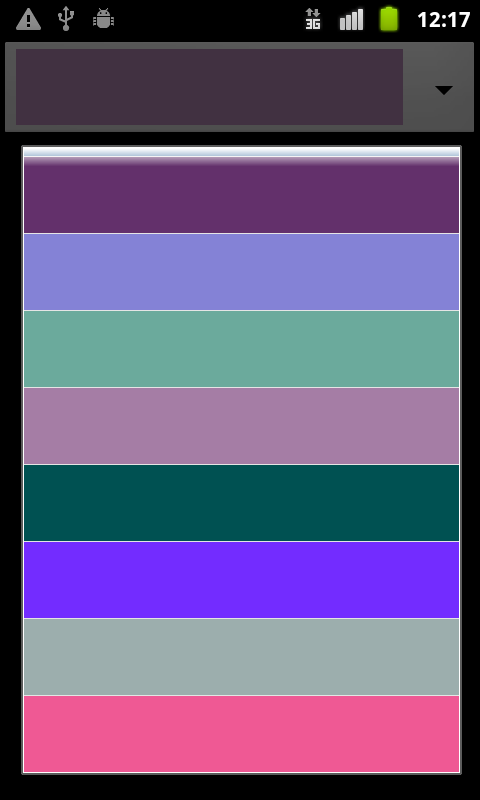

<!-- <mosyncheadertags>
<meta name="description" content="This guide shows how to use the MoSync CustomPicker Widget." />
<meta name="keywords" content="mobile development,sdk,ide,apps,mobile,apps,android,ios,iphone,ipad,camera,
mobile,c,c++,open source,porting,dev,application,ide,cross
platform,programming,mosync,native ui,nativeui" />
<title>CustomPicker Widget</title>
</mosyncheadertags> -->

# CustomPicker Widget

Supported platforms: Android and iOS.

***

## Overview

The **NativeUI::CustomPicker** widget is used to select one value from a set.

The picker is displayed as a widget with a drop-down arrow. Touching the widget displays the selection list ("spinning-wheel"), where items are shown as rows.

Here are Android screenshots from the CustomPickerApp code example (see source code below):

{: .screenshot}
{: .screenshot}

## Classes and methods

The widget class is **NativeUI::CustomPicker**.

The class used for items can be of type NativeUI::Layout or NativeUI::Widget subclasses. 

Items must have fix sizes (width and height), and all children should have the same size as set by NativeUI::CustomPicker methods **setRowHeight** and **setRowWidth**. It is recommended to set those values before the widget is displayed on the screen.

Redrawing of all rows is done when the **reloadData** method is called. Whenever updating item properties (for example changing the item background color), it is recommended to call this method.

On iOS a selection indicator can be displayed by calling the **showSelectionIndicator** method. By default, it is hidden.

Setting the selected row can be done using the method **setSelectedItemIndex**, with the row index as parameter. The selected item can be found by calling the **getSelectedItemIndex** method.

The widget has its own listener, called **NativeUI::CustomPickerListener**, so If you want to be notified when user changes the selected item you should call **addCustomPickerListener** to register your listener.

## Code example - CustomPickerApp

CustomPickerApp is simple app that shows how to use the CustomPicker widget. Note that this example is not included in the MoSync SDK distribution.

To run this example, open the MoSync IDE and create a new app based on the template "C/C++ NativeUI Project" (File / New / Project / MoSync Project / C/C++ / C/C++ NativeUI Project). Then open main.cpp, delete the existing code, and paste the code below into the file. Then just build and run the project.

File main.cpp:

    #include <mastdlib.h>
    #include <MAUtil/Moblet.h>
    #include <NativeUI/CustomPicker.h>
    #include <NativeUI/CustomPickerListener.h>
    #include <NativeUI/Layout.h>
    #include <NativeUI/Screen.h>
    #include <NativeUI/VerticalLayout.h>

    class NativeUIMoblet :
        public MAUtil::Moblet,
        public NativeUI::CustomPickerListener

    {
    public:
        NativeUIMoblet()
        {
            MAExtent screenSize = maGetScrSize();
            mRowWidth = EXTENT_X(screenSize);
            mRowHeight = EXTENT_Y(screenSize) / 10;
            createUI();
        }

        virtual ~NativeUIMoblet()
        {
            mCustomPicker->removeCustomPickerListener(this);
            delete mScreen;
        }

        void createUI()
        {
            mScreen = new NativeUI::Screen();
            mLayout = new NativeUI::VerticalLayout();
            mScreen->setMainWidget(mLayout);
            mCustomPicker = new NativeUI::CustomPicker();
            mCustomPicker->setWidth(mRowWidth);
            mCustomPicker->setRowWidth(mRowWidth);
            mCustomPicker->setRowHeight(mRowHeight);
            mCustomPicker->showSelectionIndicator();
            mCustomPicker->addCustomPickerListener(this);
            mLayout->addChild(mCustomPicker);
            addRows();
            mScreen->show();
        }

        void addRows()
        {
            const int countRows = 10;
            for (int index = 0; index < countRows; index++)
            {
                NativeUI::VerticalLayout* child = new NativeUI::VerticalLayout();
                child->setWidth(mRowWidth);
                child->setHeight(mRowHeight);
                child->setBackgroundColor(getRandomColor());
                mCustomPicker->addChild(child);
            }
        }

        int getRandomColor()
        {
            int red = rand() % 256;
            int green = rand() % 256;
            int blue = rand() % 256;
            int hexColor = (red << 16) + (green << 8) + blue;
            return hexColor;
        }

        virtual void customPickerItemChanged(
            NativeUI::CustomPicker* customPicker,
            NativeUI::Widget* selectedItem,
            const int selectedItemIndex)
        {
            printf("Selected item index is %d", selectedItemIndex);
        }

        void keyPressEvent(int keyCode, int nativeCode)
        {
            if (MAK_BACK == keyCode || MAK_0 == keyCode)
            {
                // Call close to exit the application.
                close();
            }
        }

    private:
        NativeUI::Screen* mScreen;
        NativeUI::VerticalLayout* mLayout;
        NativeUI::CustomPicker* mCustomPicker;
        int mRowWidth;
        int mRowHeight;
    };

    extern "C" int MAMain()
    {
        MAUtil::Moblet::run(new NativeUIMoblet());
        return 0;
    }

## Test program

Another test program is [CustomPickerTest](https://github.com/MoSync/MoSync/tree/ThreeThree/testPrograms/native_ui_lib/CustomPickerTest), which is available on GitHub.
